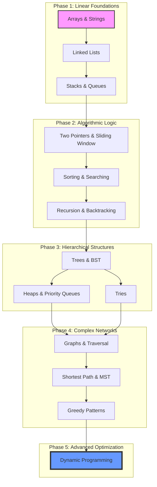

# DSAWithSwift - Complete Swift DSA Study Guide

A comprehensive, pattern-driven repository for mastering Data Structures and Algorithms using Swift. This project is designed as a modular, standalone library of 150+ common interview problems, categorized by algorithmic patterns rather than difficulty.

## 🚀 Key Features

- **Pattern-Based Learning**: Chapters organized by core concepts (Sliding Window, Two Pointers, Monotonic Stack, etc.).
- **Standalone Implementations**: Every problem file includes all necessary helper structures (`ListNode`, `TreeNode`, `DSU`) to run in isolation.
- **Conceptual Documentation**: Each topic includes a `Concept.md` file explaining the theory, Big O complexity, and when to apply the pattern.
- **Clean & Documented**: Code follows Swift's best practices with detailed headers and complexity analysis for every solution.
- **Test-Ready**: Integrated test cases at the end of each file for local verification.

## 🗺️ Recommended Study Path

To master these patterns effectively, we recommend following this hierarchical path. Each level builds the foundation for the next:



## 📂 Repository Structure

The repository follows a granular hierarchy for efficient navigation:

| Category | Topics Included |
| :--- | :--- |
| **Arrays** | Sliding Window (Fixed/Variable), Two Pointers, Prefix Sum, Kadane's |
| **Graphs** | Traversal (BFS/DFS), Shortest Path (Dijkstra, Bellman-Ford, Floyd-Warshall), Spanning Trees (Kruskal, Prims), Union-Find (DSU) |
| **Trees** | BST, Path-based (Diameter, Max Path Sum), Traversals, Recursion Patterns |
| **Heaps** | Top K Elements, K-way Merge, Frequency Sorting, Greedy Selection |
| **Stacks** | Monotonic Stacks (Increasing/Decreasing), Histogram Pattern, Range & Span |
| **Strings** | Pattern Matching (KMP, Rabin-Karp, Z-Algorithm), Sliding Window |
| **Recursion** | Backtracking (Permutations, Subsets, Word Search), Divide & Conquer |
| **Sorting** | All Comparison & Non-Comparison (Radix, Counting, Bucket) Sorts |

## 🛠️ How to Use

### 1. Study the Concept
Navigate to any topic folder and read the `Concept.md`. This provides the mental model required to solve problems in that category.

### 2. Run Implementations
Each file is a standalone Swift script. You can execute them directly via the terminal:

```bash
# Example: Running the Kruskal Algorithm implementation
swift Graphs/SpanningTree/Kruskal/KruskalAlgorithm.swift
```

## 📝 Example Output

When you run an implementation, it provides a clean output of the test cases:

```text
Minimum Weight Sum (Kruskal): 19
Index of 4 in sorted array: 3
Maximal Rectangle Area: 6
```

## 📜 License

This project is licensed under the **MIT License**. See the [LICENSE](LICENSE) file for details.

## 📅 6-Month Study Guide

A structured roadmap to master Data Structures and Algorithms from scratch using this repository.

| Month | Focus Area | Key Patterns | Featured Problems |
| :--- | :--- | :--- | :--- |
| **Month 1** | **Arrays & Basic Logic** | Sliding Window, Two Pointers, Binary Search | [TwoSumSorted.swift](file:///Array/TwoPointer/OppositeEnds/TwoSumSorted.swift), [LongestSubstringNoRepeat.swift](file:///String/SlidingWindow/LongestSubstring/LongestSubstringNoRepeat.swift), [BinarySearchFindRange.swift](file:///SearchingAlgorithms/BinarySearch/BinarySearchFindRange.swift) |
| **Month 2** | **Linear Data Structures** | Linked Lists, Valid Parentheses, Monotonic Stack | [ReverseLinkedList.swift](file:///LinkedList/ReverseLinkedList.swift), [ValidParentheses.swift](file:///Stack/ExpressionHandling/ValidParentheses.swift), [NextGreaterElement.swift](file:///Stack/MonotonicStack/Decreasing/NextGreaterElement.swift) |
| **Month 3** | **Hierarchical Structures** | Trees, BST, LCA, Path Sums | [DiameterOfBinaryTree.swift](file:///Trees/PathBased/Diameter_Height_Depth/DiameterOfBinaryTree.swift), [ValidateBST.swift](file:///Trees/BST/ValidateBST.swift), [LowestCommonAncestor.swift](file:///Trees/RecursionPatterns/BottomUp/LowestCommonAncestor.swift) |
| **Month 4** | **Heaps & Tries** | Top K, Priority Queues, Prefix Matching | [KthLargestElement.swift](file:///Heap/Kth_Element/KthLargestElement.swift), [MergeKSortedLists.swift](file:///Recursion/Divide_Conquer/MergeSortPattern/MergeKSortedLists.swift), [ImplementTrie.swift](file:///Trie/PrefixSearch/ImplementTrie.swift) |
| **Month 5** | **Graph Theory** | BFS, DFS, Shortest Paths, Union-Find | [MaxAreaOfIsland.swift](file:///Graphs/ConnectedComponents/MaxAreaOfIsland.swift), [DijkstraAlgorithm.swift](file:///Graphs/ShortestPath/Dijkstra/DijkstraAlgorithm.swift), [RedundantConnection.swift](file:///Graphs/UnionFind_DSU/RedundantConnection.swift) |
| **Month 6** | **Optimization & Greedy** | Backtracking, Greedy Selection, MST | [NQueens.swift](file:///Recursion/Backtracking/Pruning_StateTracking/NQueens.swift), [FractionalKnapsack.swift](file:///Greedy/FractionalKnapsack/FractionalKnapsack_ItemSorting.swift), [KruskalAlgorithm.swift](file:///Graphs/SpanningTree/Kruskal/KruskalAlgorithm.swift) |

---
*Created with ❤️ for the Swift Developer Community.*
